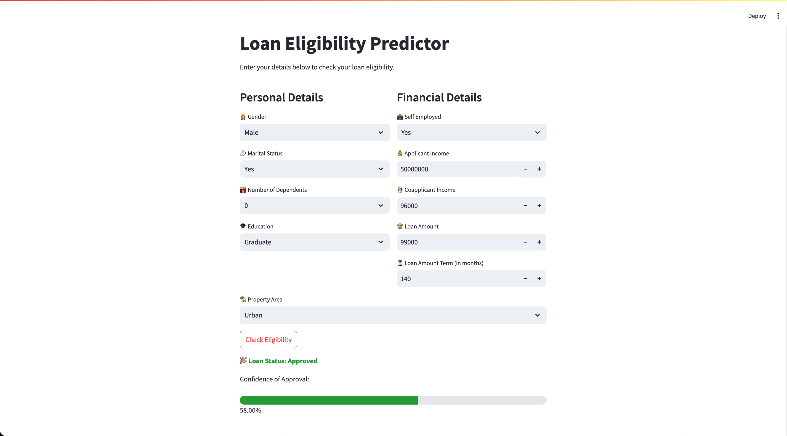

# Loan Eligibility Predictor

  

An application for prediction loan eligibility for applicants based on their personal, financial, and property-related information.



---

## Table of Contents

- [Overview](#overview)
- [Features](#features)
- [Installation](#installation)
- [License](#license)

---

## Overview

The **Loan Eligibility Predictor** is a tool built to assist banks and financial institutions in determining whether an applicant qualifies for a loan. Trained on a Random Forest Classifier, which is then deployed as a web application using Streamlit. The app allows users to input their details and receive instant feedback on their loan eligibility, along with a confidence score indicating the model's certainty.

---

## Features

- Predicts loan eligibility in real-time.
- Provides a confidence score for each prediction.
- User-friendly interface powered by Streamlit.

---

## Installation

1. **Clone the Repository**:
   ```bash
   git clone https://github.com/yourusername/loan-eligibility-predictor.git
   cd loan-eligibility-predictor
   ```

2. **Set Up a Virtual Environment** (Optional but Recommended):
   ```bash
   python3 -m venv venv
   source venv/bin/activate  # On Windows: venv\Scripts\activate
   ```

3. **Install Dependencies**:
   ```bash
   pip install -r requirements.txt
   ```

4. **Run the Streamlit App**:
   ```bash
   streamlit run app.py
   ```

---

## License

This project is licensed under the MIT License. See the [LICENSE](LICENSE) file for details.

---